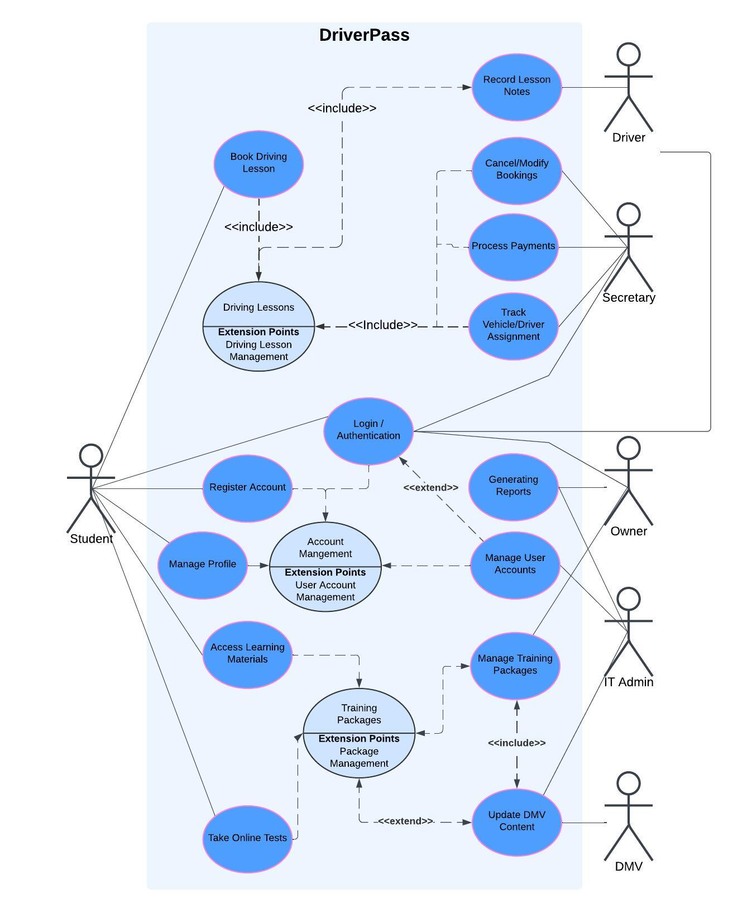
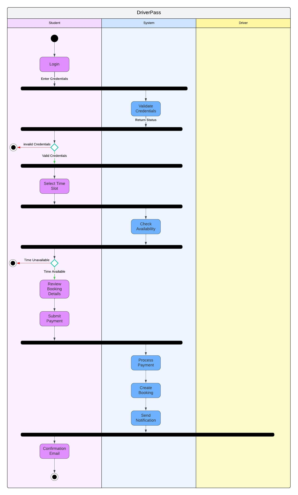
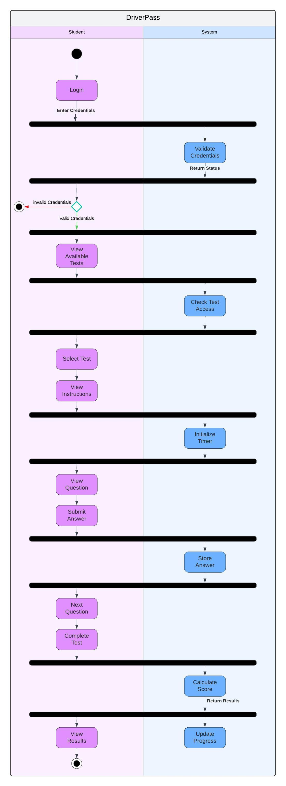
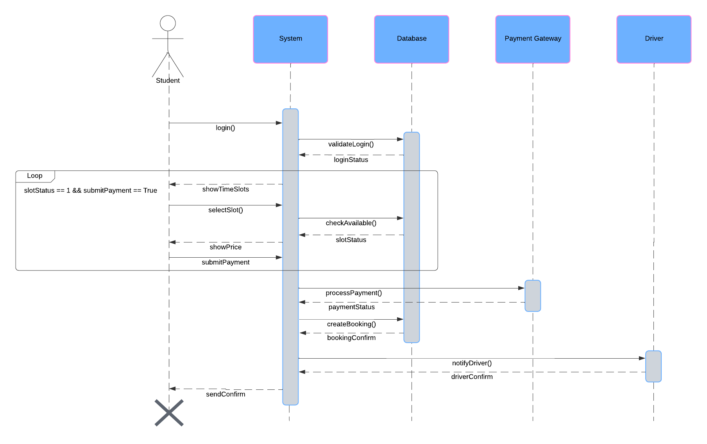
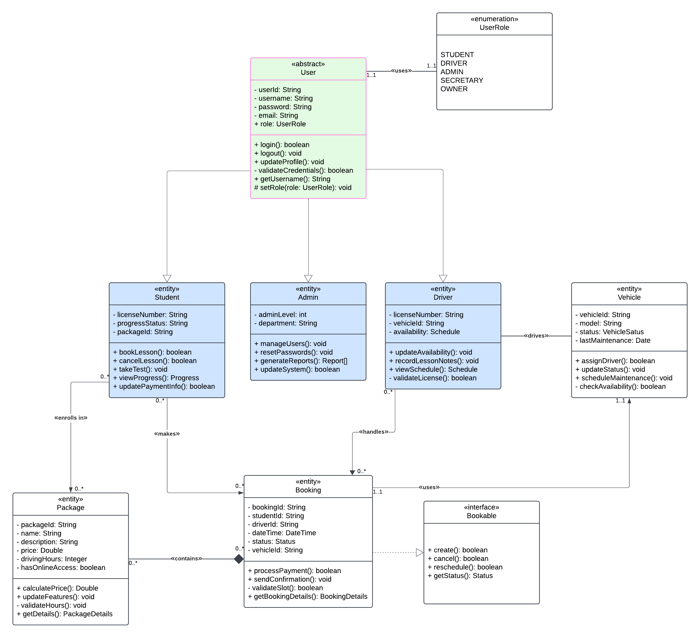

# CS 255 System Design Document

## UML Diagrams

### UML Use Case Diagram

### UML Activity Diagrams

#### Book Driving Lesson:

#### Take Test Online:

### UML Sequence Diagram

#### Book a Driving Lesson:

### UML Class Diagram

## Technical Requirements

### Hardware Requirements

#### Server Infrastructure
* Cloud-based web servers with auto-scaling capabilities
* Minimum 16GB RAM per server instance
* Multi-core processors (8+ cores recommended)
* Load balancers for traffic distribution
* Redundant servers for failover
* Minimum 1TB storage with expansion capability

#### Backup Systems
* Dedicated backup servers
* RAID storage configuration
* Offsite backup storage
* Automated backup devices

#### Client Requirements
* Standard web browsers (Chrome, Firefox, Safari, Edge)
* Minimum 4GB RAM on client devices
* Support for both desktop and mobile devices
* Webcams for identity verification

### Software Requirements

#### System Software
* Cloud platform (AWS/Azure/Google Cloud)
* Web server software (Nginx/Apache)
* SSL certificates for secure connections
* Database management system (PostgreSQL/MySQL)
* Load balancing software
* Automated backup software
* Network monitoring tools

#### Application Software
* Web application framework
* Payment gateway integration software
* Email service integration
* PDF generation software for reports/receipts
* Calendar/scheduling system
* Content management system
* User authentication system

#### Development Tools
* Version control system (Git)
* Integrated development environment (IDE)
* Testing frameworks
* Continuous integration/deployment tools
* API development and testing tools
* Database management tools
* Code quality analysis tools

### Infrastructure Requirements

#### Network Infrastructure
* High-speed internet connection (1Gbps minimum)
* Redundant internet connections
* VPN for secure administrative access
* Firewall protection
* DMV integration interface
* Internal network for staff access

#### Security Infrastructure
* Multi-factor authentication system
* Role-based access control
* Data encryption (at rest and in transit)
* Security monitoring tools
* Intrusion detection/prevention systems
* Regular security audit capabilities

#### Database Infrastructure
* Primary database server
* Replica databases for redundancy
* Database backup system
* Data archival system
* Database monitoring tools

### Compliance & Integration Requirements

#### Payment Processing
* PCI DSS compliant payment system
* Integration with major payment gateways
* Secure payment processing environment
* Transaction logging system

#### DMV Integration
* Secure API connection to DMV systems
* Real-time update capabilities
* Data synchronization tools
* Compliance with DMV data standards

#### Backup & Recovery
* Automated backup systems
* Point-in-time recovery capability
* Disaster recovery plan
* Business continuity systems

### Maintenance Requirements

#### System Maintenance
* Monitoring tools for system health
* Performance optimization tools
* Log management system
* System update management
* Configuration management

#### Support Tools
* Help desk system
* Knowledge base software
* Remote support tools
* Issue tracking system
* User feedback system